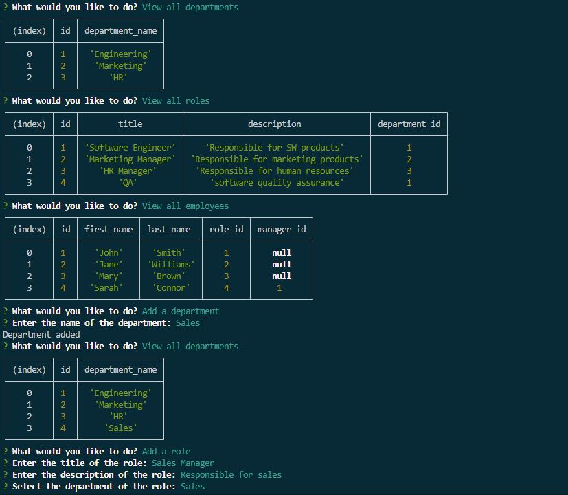

# SQL: Employee Tracker

This is a command-line application that allows users to manage employees, departments, and roles in a company. It is built using Node.js and MySQL.

## Video Walkthrough 

[Video Walkthrough](https://youtu.be/XpM4n8YPrLY)
## Mockup image

## Installation

* Copy code
* npm i

## License
This project is licensed under the MIT License.